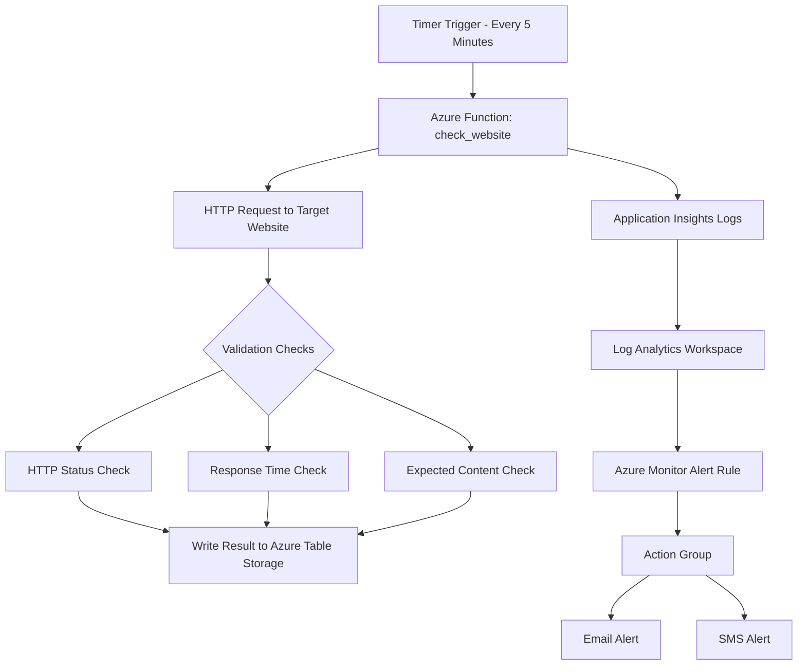
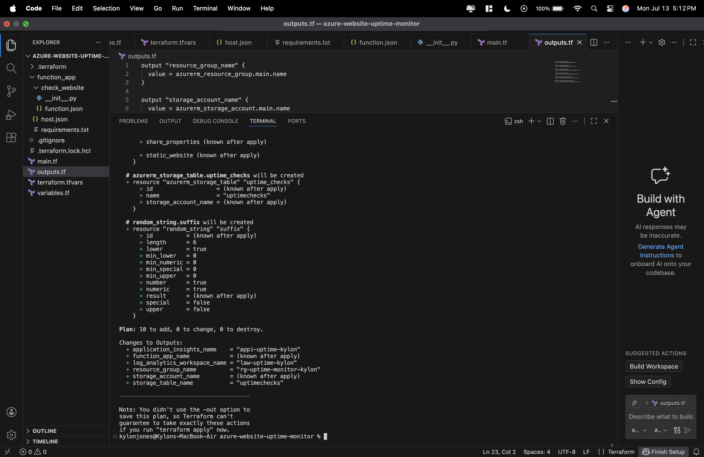
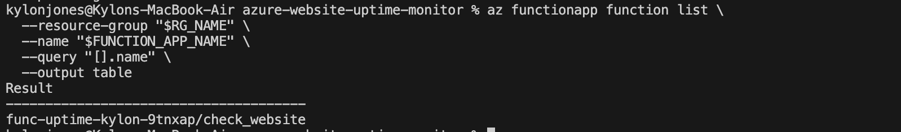
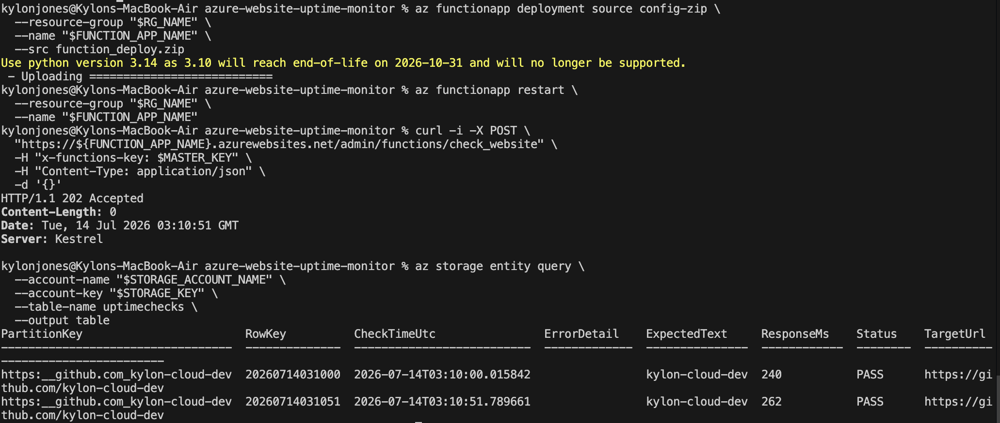
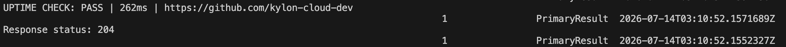
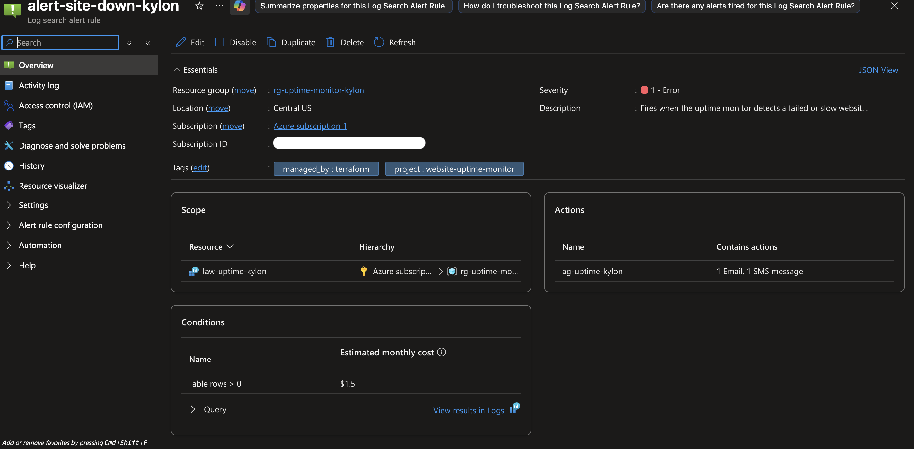
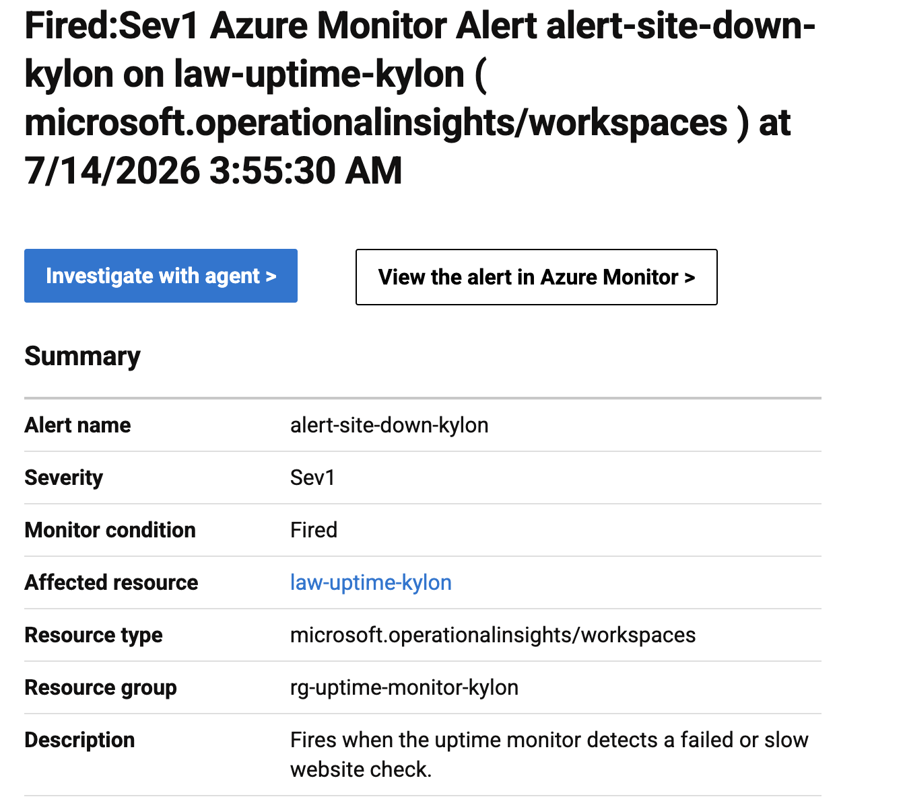
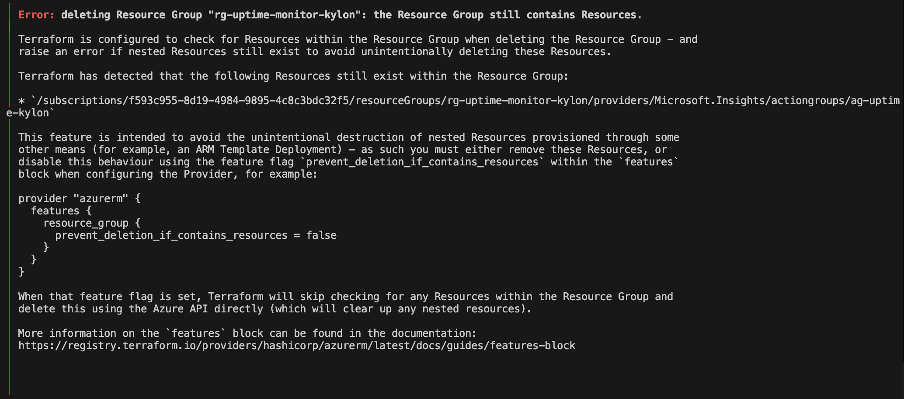
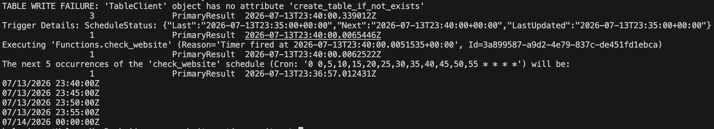

# Azure Website Uptime Monitor

## Overview

This project is an Azure-based website uptime monitoring solution built with Terraform, Azure Functions, Python, Azure Table Storage, Application Insights, Log Analytics, and Azure Monitor alerts.

The monitor checks a target website on a schedule, validates that the site is reachable, measures response time, verifies expected page content, stores every check result in Azure Table Storage, and triggers an Azure Monitor alert when a failure is detected.

For this project, I monitored:

```text
https://github.com/kylon-cloud-dev
```

The solution was tested with both healthy checks and a controlled failure scenario to confirm that the alerting workflow worked end-to-end.

---

## Business Problem

Websites can fail silently. A business owner may not know their site is down, slow, or showing incorrect content until a customer complains or revenue is impacted.

This project solves that problem by creating an automated uptime monitoring workflow that:

- Checks a website every 5 minutes
- Measures response time
- Confirms expected page content is present
- Stores each check result for historical review
- Sends alert notifications when a failure is detected

This turns website downtime from a hidden issue into a monitored, logged, and actionable event.

---

## Architecture



---

## Azure Resources Deployed

Terraform provisions the following Azure resources:

| Resource | Purpose |
|---|---|
| Resource Group | Logical container for all project resources |
| Storage Account | Stores Azure Function runtime data and Table Storage results |
| Storage Table | Stores uptime check records |
| Linux Function App | Runs the Python website monitor |
| App Service Plan | Hosts the Function App |
| Log Analytics Workspace | Stores logs for querying and alerting |
| Application Insights | Captures Function telemetry and traces |
| Azure Monitor Alert Rule | Detects failed website checks |
| Action Group | Sends email and SMS notifications |

---

## Technologies Used

- Azure
- Terraform
- Azure Functions
- Python
- Azure Table Storage
- Application Insights
- Log Analytics
- Azure Monitor Alerts
- Azure CLI
- KQL
- Git/GitHub

---

## Project Structure

```text
azure-website-uptime-monitor/
├── main.tf
├── variables.tf
├── outputs.tf
├── README.md
├── .gitignore
├── function_app/
│   ├── host.json
│   ├── requirements.txt
│   └── check_website/
│       ├── __init__.py
│       └── function.json
└── screenshots/
    ├── 01-terraform-apply-success.png
    ├── 02-troubleshooting-app-service-plan-quota-error.png
    ├── 03-troubleshooting-resource-group-leftover-action-group.png
    ├── 04-function-deployed-check-website.png
    ├── 05-table-storage-check-results.png
    ├── 06-troubleshooting-tableclient-create-table-error.png
    ├── 07-application-insights-logs.png
    ├── 08-alert-rule-action-group.png
    └── 09-email-sms-alert-received.png
```

---

## Key Technical Decisions

### Azure Functions

I used Azure Functions because this workload is lightweight, scheduled, and event-driven. The monitor only needs to run every 5 minutes, so using a virtual machine would add unnecessary cost and operational overhead.

### Timer Trigger

The Function uses a timer trigger to run automatically every 5 minutes. This allows the monitor to check the target website on a consistent schedule without manual intervention.

### Azure Table Storage

Azure Table Storage was used because each uptime check result is a simple structured record.

Each row stores:

- Target URL
- Timestamp
- Status
- Response time
- Error details
- Expected text

This made Table Storage a good low-cost option for storing operational check results.

### Application Insights and Log Analytics

Application Insights captures Function execution telemetry, while Log Analytics provides a queryable workspace for troubleshooting and alerting.

### Expected Content Validation

The monitor does more than check whether the website returns HTTP 200. It also validates that expected page content is present.

This is important because a website can technically respond successfully while still showing the wrong page, a broken deployment, a maintenance screen, or incorrect content.

---

## Monitoring Logic

The Azure Function checks for:

1. Website reachability
2. HTTP response status
3. Response time threshold
4. Expected content on the page

Example statuses:

| Status | Meaning |
|---|---|
| PASS | Website is reachable, fast enough, and contains expected text |
| FAIL | Website is unreachable, returns an unexpected response, or is missing expected content |
| SLOW | Website responds but exceeds the response time threshold |

---

## Deployment Steps

### 1. Initialize Terraform

```bash
terraform init
```

### 2. Format and Validate Terraform

```bash
terraform fmt
terraform validate
```

### 3. Review the Terraform Plan

```bash
terraform plan
```

### 4. Deploy Azure Infrastructure

```bash
terraform apply
```

### 5. Package the Azure Function

```bash
cd function_app

python3 -m pip install -r requirements.txt --target .python_packages/lib/site-packages

zip -r ../function_deploy.zip . -x "*.DS_Store"

cd ..
```

### 6. Deploy the Function Code

```bash
RG_NAME=$(terraform output -raw resource_group_name)
FUNCTION_APP_NAME=$(terraform output -raw function_app_name)

az functionapp deployment source config-zip \
  --resource-group "$RG_NAME" \
  --name "$FUNCTION_APP_NAME" \
  --src function_deploy.zip
```

### 7. Restart the Function App

```bash
az functionapp restart \
  --resource-group "$RG_NAME" \
  --name "$FUNCTION_APP_NAME"
```

### 8. Manually Trigger the Function for Testing

```bash
MASTER_KEY=$(az functionapp keys list \
  --resource-group "$RG_NAME" \
  --name "$FUNCTION_APP_NAME" \
  --query "masterKey" \
  --output tsv)

curl -i -X POST \
  "https://${FUNCTION_APP_NAME}.azurewebsites.net/admin/functions/check_website" \
  -H "x-functions-key: $MASTER_KEY" \
  -H "Content-Type: application/json" \
  -d '{}'
```

---

## Verification

### Terraform Deployment

Terraform successfully deployed the Azure infrastructure.



---

### Function App Deployment

The `check_website` Function was successfully deployed and visible in Azure.



---

### Table Storage Results

The Function successfully wrote website check results to Azure Table Storage.

The table captured:

- Target URL
- Response time
- Expected text
- PASS/FAIL status
- Error details



---

### Application Insights Logs

Application Insights and Log Analytics captured successful Function execution logs.



---

### Alert Rule and Action Group

Azure Monitor was configured with a Log Search Alert Rule and an Action Group containing email and SMS actions.



---

### Alert Fired Successfully

A controlled failure was triggered by temporarily changing the expected page text to a value that did not exist on the target website.

Azure Monitor detected the failure and fired the alert.



---

## Controlled Failure Test

To confirm alerting worked, I temporarily changed the expected text value from:

```text
kylon-cloud-dev
```

to:

```text
this-text-should-not-exist-kylon-test
```

This caused the Function to detect that the expected content was missing from the page.

The monitor recorded `FAIL` results in Table Storage and generated a `SITE DOWN` log entry in Application Insights. Azure Monitor then fired the configured alert and sent a notification through the Action Group.

After confirming the alert fired, I restored the expected text back to:

```text
kylon-cloud-dev
```

and confirmed the monitor returned to a healthy `PASS` state.

---

## Troubleshooting

### App Service Plan Quota Error

During the first deployment attempt, Azure blocked the App Service Plan creation because the subscription had a compute quota limit of 0 in the selected region.

Resolution:

- Identified the quota issue from the Terraform error
- Changed the deployment region from East US to Central US
- Re-ran Terraform plan and apply
- Deployment succeeded in the new region


---

### Resource Group Cleanup Issue

During cleanup after a failed deployment, Terraform could not delete the Resource Group because an Azure Monitor Action Group still existed inside it.

Resolution:

- Checked Terraform state
- Destroyed the remaining Action Group first
- Re-ran Terraform cleanup successfully



---

### Table Storage Query Permission Issue

When querying Table Storage with Azure CLI using `--auth-mode login`, the request failed because my signed-in identity did not have the necessary Storage Table data-plane role.

Resolution:

- Used the storage account key for lab verification
- Confirmed that in production, least-privilege RBAC such as Storage Table Data Reader would be preferred

---

### Python SDK Method Issue

The first version of the Function attempted to call `create_table_if_not_exists()` on a TableClient object, which caused a runtime error.

Resolution:

- Removed table creation logic from the Function
- Let Terraform own Table Storage creation
- Updated the Function to only write entities to the existing table



---

### Python Indentation Error

After modifying the Function code, the Function failed with an indentation error in `__init__.py`.

Resolution:

- Used Application Insights and Log Analytics to identify the exact error
- Fixed the indentation in the Python file
- Validated the file locally with:

```bash
python3 -m py_compile function_app/check_website/__init__.py
```

- Redeployed the Function package

---

### Function Host 503 During Restart

After changing Function App settings, the Function host temporarily returned:

```text
503 Site Unavailable
```

Resolution:

- Waited for the Function App to warm up
- Redeployed the zip package when needed
- Restarted the Function App
- Confirmed host health through the admin status endpoint

---

## Security Notes

- `terraform.tfvars` is excluded from Git because it contains email and phone number values.
- Terraform state files are excluded from Git because state can contain sensitive resource data.
- Storage account keys were used only for lab verification.
- In production, I would use least-privilege RBAC and managed identity where possible.
- Screenshots were reviewed to avoid exposing email addresses, phone numbers, or subscription IDs.

---

## Cost Notes

This project uses mostly low-cost Azure resources:

- Azure Function Consumption plan
- Azure Table Storage
- Log Analytics / Application Insights
- Azure Monitor alerting

The main cost drivers are Log Analytics ingestion and alert notifications. Resources should be destroyed when testing is complete.

---

## Teardown

To remove all deployed resources:

```bash
terraform destroy
```

Confirm the Resource Group was removed:

```bash
az group exists --name rg-uptime-monitor-kylon
```

Expected result:

```text
false
```

---

## What I Learned

This project strengthened my hands-on understanding of:

- Deploying Azure serverless infrastructure with Terraform
- Packaging and deploying Python Azure Functions
- Writing operational check results to Azure Table Storage
- Using Application Insights and Log Analytics for troubleshooting
- Creating Azure Monitor alert rules with email/SMS notifications
- Debugging real Azure deployment and runtime issues
- Separating infrastructure responsibilities from application code
- Validating both healthy and failed monitoring scenarios

---